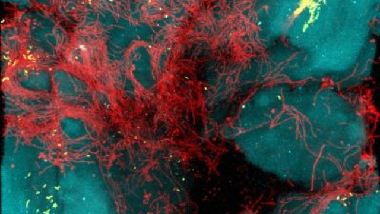

# Bellybutton_Biodiversity

Roza is a bio researcher in a prominent microbiology lab. We are helping Roza identify bacterial species that have the property to synthesis protein that tastes like beef. The lab has partnered with improbable meat a food startup to research candidate species. lab across the globe has had success by synthesizing meat from algae, fungi and microorganisms found on plant roots. However improbable beef is still looking for the elusive bacteria that will provide the perfect taste. Roza have a hypothesis that can supply the next best taste and we believe it can be found on the human body in a person's belly button. 

To test the hypothesis, we have tested the navels of people across the country to identify the bacterial species that colonize a person’s bellybutton. Roza has a completed panel for demographic information and now needs to visualize the bacterial data for each volunteer. Specifically, the volunteers should be able to identify the top 10 bacterial species in their belly buttons. That way, if Improbable Beef identifies a species as a candidate to manufacture synthetic beef, our volunteers will be able to identify whether that species is found in their navel.

  
  

Our dashboard is ready for viewing below-
https://rimamehr.github.io/Bellybutton_Biodiversity/
